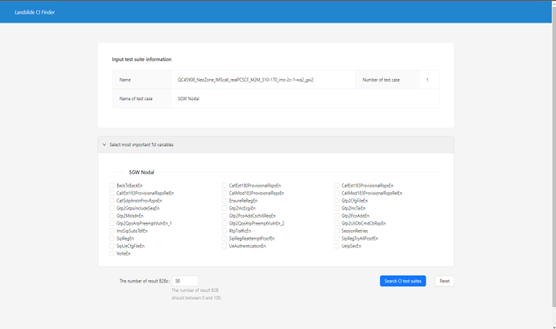

# CIfinder

## Description

LTE/5G 등 이동 통신 장비에 대한 테스팅 서비스 Landslide는 전 세계 수백 개의 글로벌 통신 회사에서 사용 중인 거대한 프로젝트다. 고객사는 Landslide의 에뮬레이터 모듈을 활용한 테스트 로직을 자유롭게 구성하여 자사 통신장비를 테스트 할 수 있다. 만약 고객사가 Landslide 사용 중 버그를 탐지하게 되면, Landslide 엔지니어는 고객사의 사용환경, 통신장비와의 호환성 여부를 모두 적용한 새로운 테스트 로직을 만들어내야만 한다. 이러한 과정은 상당한 자원과 시간이 소요된다.

이를 해결하기 위해 고객의 테스트 로직을 자동 분석하여 완성된 형태의 테스트 로직을 찾아주는 CI Finder 프로젝트가 시작되었다. 하지만 CI Finder는 테스트 로직 변수의 존재성과 값의 일대일 비교에 기반한 검색 알고리즘을 사용하고 있어, 검색 결과가 실제 업무 현장에서 제작된 것과 상이한 경우가 많았다. 이를 해결하기 위해 머신러닝 기법을 적용한 유사 테스트케이스 추천 방법론을 제안하고 해당 방법론을 적용시킨 새로운 CI Finder 2.0을 소개한다.

## DB의 Pandas Dataframe화

기존 CI finder OTS는 각 행을 OTS, 각 열을 TCL 변수로 하는 2차원 행렬로서 구성된다. 즉, DB는 M X N 행렬(M은 OTS의 개수, N은 Tcl 변수의 개수)로 구성된다. 이를 Pandas Dataframe으로 변환하여 데이터분석에 유리한 형태로 가공한다. Dataframe은 Dictionary 자료형을 기반으로 데이터의 행, 열, 특정 벡터 추출에 용이한 특징을 지닌다. 따라서 본 연구에서는 Pandas Dataframe을 기반으로 데이터 분석 과정을 수행했다.

## NLTK 라이브러리를 사용한 Tag, description의 토큰화
각 OTS 별 구성 Tcl 변수들을 단어 벡터로 제작하기 위한 첫 번째 단계로서, True인 Tcl 변수들 만 따로 추출한다. Tcl 변수에는 None, True, False 총 3가지 상태가 존재한다. None은 해당 Tcl 변수가 OTS에 존재하지 않음을 의미한다. True는 해당 Tcl 변수가 OTS에 존재하며 True 값을 가지는 것을 의미한다. False는 해당 Tcl 변수가 OTS에 존재하나 False 값을 가짐을 의미한다. False는 해당 변수가 활성화되어있지 않음을 뜻하므로 본질적으로 None과 다를 바가 없어, 이 실험에서는 True인 Tcl 변수의 이름만 사용하기로 한다.

그 다음, 표제어 추출을 시행한다. 표제어 추출이란 자연어 문장에서 문장부호, 물음표, 느낌표, 인용부호, 띄어쓰기를 제거하여 단어 리스트 형태로 가공하는 것을 말한다. Dataframe 내 모든 Tcl 변수는 리스트 스트링 형태로 가공되어 있어, Python object 형태로 변환시켜줘야 한다. 이를 위해 Python의 리스트 구분자인 ‘[’, ‘]’, ‘,’을 제거하는 표제어 추출(Lemmatizing)을 시행한다. python object로 변환되어 리스트 형태로 저장된 각 표제어들은 NLTK 라이브러리의 Tokenization을 통해 토큰으로 변환된다. NLTK의 토큰화 함수는 데이터처리가 쉽도록 일정크기의 벡터를 생성한 다음, 일반 자연어 단어를 입력하여 그 길이를 통일시키는 과정을 거친다.

## TF-IDF 단어 벡터 제작

다음으로, 토큰화 된 단어를 TF-IDF 단어 벡터로 변환한다. TF-IDF(Term Frequency Inverse Document Frequency)는 단어의 빈도와 역 문서 빈도를 사용하여, 각 토큰 마다 중요한 정도를 가중치로 부여하는 과정을 말한다. 문서의 유사도를 측정하거나 검색 시스템에서 검색 결과의 중요도를 정하는 작업, 문서 내 특정 단어의 중요도를 구하는 작업에 주로 사용된다.

TF-IDF 값은 TF와 IDF의 곱으로 표현된다. 이 태스크에서, TF는 각 OTS 내에서 특정 True TCL 변수가 등장하는 횟수를 의미하며, TCL 변수 별로 그 값을 가진다. IDF는 특정 True TCL 변수가 등장한 OTS의 수의 역수를 말한다. 이때, 총 OTS의 개수가 많아질수록 IDF값이 기하급수적으로 커지는 것을 방지하기 위해, IDF 값에 로그를 취한다. 각 TCL 변수는 일대일 대응하는 TF-IDF 값을 가진다. 이를 통해 TCL 변수의 중요도를 알 수 있다.

## K-평균 군집화 (K-means clustering)

K-평균 군집화는 데이터와 클러스터 간의 유클리드 거리의 분산을 최소화하기 위해 클러스터링을 반복하여 데이터를 분류하는 방법이다. TF-IDF 벡터에 대한 K-평균 군집화를 통해 각 True TCL 변수을 기준으로 형성된 문서 군집(Document cluster)을 제작할 수 있다. 실험은 Scikit-learn의 KMeans() 클래스를 사용하고 K=8로 설정하여 군집화를 수행했다.

## 일대일 비교 및 유사도 점수 생성

K-평균 군집화를 통해 제작된 클러스터는 문서 분류를 위한 데이터셋이라고 표현할 수 있다. Scikit-learn의 Kmeans() 클래스는 한 개의 문서를 입력으로 받아 해당 문서가 어떤 클래스에 해당하는지 예측하는 Inference 함수를 제공한다. 이를 통해 임의의 CTS가 어떤 클러스터에 속하는지 예측하도록 한다.

다음으로, 해당 클러스터 내 모든 OTS와 입력 CTS에 대해 2.1 일반 비교법을 수행하도록 한다. 일반 비교법은 각 Boolean 변수간의 의존성을 파악할 수 없어 정확도가 떨어질 수 있다는 단점이 있다. 하지만 1차적으로 유사한 OTS를 모아놓은 클러스터 안에서 일반 비교법을 수행할 경우, 의존성을 고려하지 않은 채 변수 내용만 같은 타 클러스터의 OTS가 배제되므로 각 변수간 의존성을 파악할 필요 없이 일대일 비교만으로 유의미한 유사 OTS를 추출할 수 있다.

## How to run the frontend part

1. npm install
2. npm start (for dev mode)
3. npm run build (for build the html file)

## How to run the backend server

1. Download DB file from Google drive and locate it in database directory
2. pip install [package name that has error] (no installation.txt)
3. uvicorn main:app
